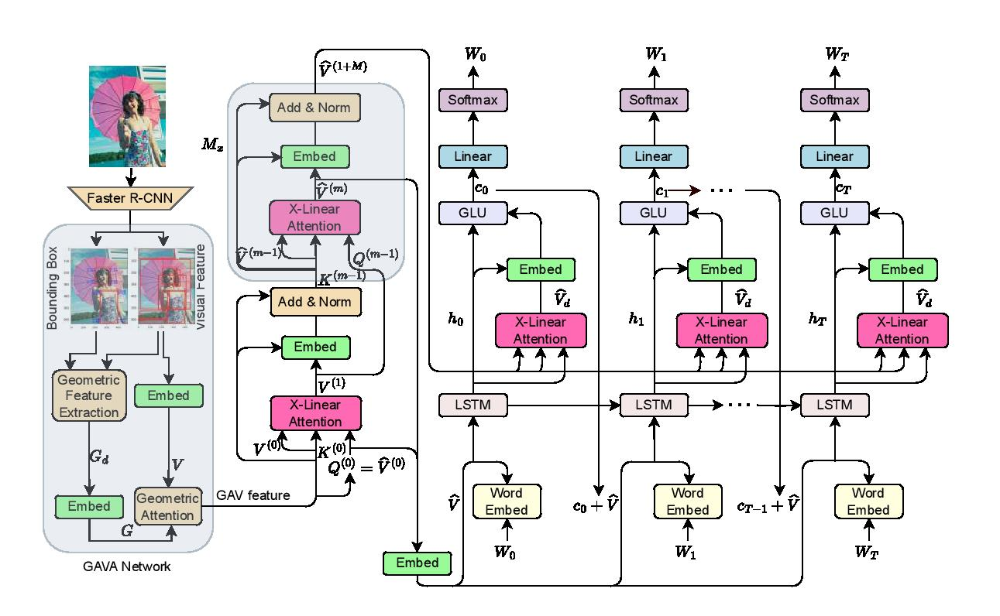

# Introduction
This repository is for **GAVA: Geometric-Aware Visual Attention for Image Captioning** (CVPR 2024). The original paper can be found [here](https://arxiv.org/pdf/2003.14080.pdf).

Please cite with the following BibTeX:

```
@inproceedings{xlinear2020cvpr,
  title={GAVA: Geometric-Aware Visual Attention for Image Captioning},
  author={Pan, Yingwei and Yao, Ting and Li, Yehao and Mei, Tao},
  booktitle={Proceedings of the IEEE/CVF Conference on Computer Vision and Pattern Recognition},
  year={2020}
}
```

<p align="center">
  
</p>

## Requirements
* Python 3
* CUDA 10
* numpy
* tqdm
* easydict
* [PyTorch](http://pytorch.org/) (>1.0)
* [torchvision](http://pytorch.org/)
* [coco-caption](https://github.com/ruotianluo/coco-caption)

## Data preparation
1. Download the [bottom up features](https://github.com/peteanderson80/bottom-up-attention) and convert them to npz files:
```
python2 tools/create_feats.py --infeats bottom_up_tsv --outfolder ./mscoco/feature/up_down_100
```

This command will generate two different types of features:
- `up_down_100`: Contains the main feature files.
- `up_down_100_box`: Contains the bounding box coordinates.

2. Download the [annotations](https://drive.google.com/open?id=1i5YJRSZtpov0nOtRyfM0OS1n0tPCGiCS) into the mscoco folder. More details about data preparation can be referred to [self-critical.pytorch](https://github.com/ruotianluo/self-critical.pytorch).

3. Download [coco-caption](https://github.com/ruotianluo/coco-caption) and set up the path of `__C.INFERENCE.COCO_PATH` in `lib/config.py`.

4. The pretrained models and results for Cross Entropy Loss can be downloaded [here](https://drive.google.com/file/d/1_5FttnUADK49ZW1fUEdZn-kitgLgytkS/view?usp=drive_link) and [here](https://drive.google.com/file/d/1q0qSYpHfPvx-OhZPNXnp7Ko6b0eEOstc/view?usp=drive_link).

5. The pretrained models and results for CIDEr Score Optimization can be downloaded [here](https://drive.google.com/file/d/1akyfuiCclsU12nnZEWJpBronykBQd5ZN/view?usp=drive_link) and [here](https://drive.google.com/file/d/1RkU9i8Ow70ps-103OSj6O24_4ZV3wgv6/view?usp=drive_link).

6. The geometric features can be downloaded [here](https://drive.google.com/file/d/1eqmeavgomteESeR43tpW8awIl0qOcDiA/view?usp=drive_link).

### Generating and Normalizing Geometric Features
To generate and normalize geometric features, follow these steps:

1. Ensure you have extracted the bounding box coordinates into `up_down_100_box` as described above.

2. Use the provided script to generate and normalize the geometric features, which will be saved in the `geo_feats` directory.

This script will generate normalized geometric features and save them in the `geo_feats` directory.

## Training
### Train GAVA model
```
bash experiments/gavalan/train.sh
```

### Train GAVA model using self critical
Copy the pretrained model into `experiments/gavaxlan_rl/snapshot` and run the script:
```
bash experiments/gavaxlan_rl/train.sh
```

## Evaluation
```
CUDA_VISIBLE_DEVICES=0 python3 main_test.py --folder experiments/model_folder --resume model_epoch
```

## Acknowledgements
Thanks to the contribution of [self-critical.pytorch](https://github.com/ruotianluo/self-critical.pytorch) and the awesome PyTorch team.
