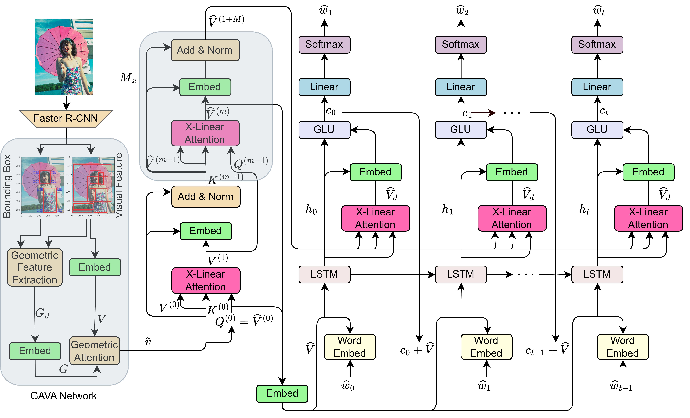

# Introduction
This repository is for **GAVA: Geometric-Aware Visual Attention for Image Captioning** (CVPR 2024). The original paper can be found [here](https://arxiv.org/pdf/2003.14080.pdf).

Please cite with the following BibTeX:

```
@inproceedings{xlinear2020cvpr,
  title={X-Linear Attention Networks for Image Captioning},
  author={Pan, Yingwei and Yao, Ting and Li, Yehao and Mei, Tao},
  booktitle={Proceedings of the IEEE/CVF Conference on Computer Vision and Pattern Recognition},
  year={2020}
}
```

<p align="center">
  
</p>

## Requirements
* Python 3
* CUDA 10
* numpy
* tqdm
* easydict
* [PyTorch](http://pytorch.org/) (>1.0)
* [torchvision](http://pytorch.org/)
* [coco-caption](https://github.com/ruotianluo/coco-caption)

## Data preparation
1. Download the [bottom up features](https://github.com/peteanderson80/bottom-up-attention) and convert them to npz files
```
python2 tools/create_feats.py --infeats bottom_up_tsv --outfolder ./mscoco/feature/up_down_100
```

This command will generate two different types of features:
- `up_down_100`: Contains the main feature files.
- `up_down_100_box`: Contains the bounding box coordinates.

2. Download the [annotations](https://drive.google.com/open?id=1i5YJRSZtpov0nOtRyfM0OS1n0tPCGiCS) into the mscoco folder. More details about data preparation can be referred to [self-critical.pytorch](https://github.com/ruotianluo/self-critical.pytorch).

3. Download [coco-caption](https://github.com/ruotianluo/coco-caption) and set up the path of `__C.INFERENCE.COCO_PATH` in `lib/config.py`.

4. The pretrained models and results for Cross Entropy Loss can be downloaded [here](https://drive.google.com/file/d/1_5FttnUADK49ZW1fUEdZn-kitgLgytkS/view?usp=drive_link) and [here](https://drive.google.com/file/d/1q0qSYpHfPvx-OhZPNXnp7Ko6b0eEOstc/view?usp=drive_link).

5. The pretrained models and results for CIDEr Score Optimization can be downloaded [here](https://drive.google.com/file/d/1akyfuiCclsU12nnZEWJpBronykBQd5ZN/view?usp=drive_link) and [here](https://drive.google.com/file/d/1RkU9i8Ow70ps-103OSj6O24_4ZV3wgv6/view?usp=drive_link).

6. The geometric features can be downloaded [here](https://drive.google.com/file/d/1eqmeavgomteESeR43tpW8awIl0qOcDiA/view?usp=drive_link).

### Generating and Normalizing Geometric Features
To generate and normalize geometric features, follow these steps:

1. Ensure you have extracted the bounding box coordinates into `up_down_100_box` as described above.

2. Run the script below to generate and normalize the geometric features, which will be saved in the `geo_feats` directory:

```python
import numpy as np
import os
from tqdm import tqdm

def extract_geometric_features(bbox_file):
    try:
        bboxes = np.load(bbox_file)
        num_rois = bboxes.shape[0]
        if not (10 <= num_rois <= 100):
            raise ValueError(f"Expected between 10 and 100 ROIs, but found {num_rois} ROIs in {bbox_file}")

        geo_features = np.zeros((num_rois, 6))  # 6 features: x, y, w, h, aspect_ratio, area

        for i in range(num_rois):
            x, y, w, h = bboxes[i]
            aspect_ratio = w / h if h != 0 else 0  # Avoid division by zero
            area = w * h
            geo_features[i] = [x, y, w, h, aspect_ratio, area]

        return geo_features
    except Exception as e:
        print(f"Error processing {bbox_file}: {e}")
        return None

def normalize_geometric_features(geo_features):
    if geo_features is None:
        return None
    min_vals = geo_features.min(axis=0)
    max_vals = geo_features.max(axis=0)
    normalized_features = (geo_features - min_vals) / (max_vals - min_vals)

    return normalized_features

def preprocess_npz_files(npz_folder, bbox_folder, geo_output_folder):
    files = [f for f in os.listdir(npz_folder) if f.endswith('.npz')]
    for file_name in tqdm(files, desc="Processing files", unit="file"):
        npz_path = os.path.join(npz_folder, file_name)
        bbox_path = os.path.join(bbox_folder, file_name.replace('.npz', '.npy'))
        geo_features = extract_geometric_features(bbox_path)

        if geo_features is not None:
            normalized_geo_features = normalize_geometric_features(geo_features)
            geo_save_path = os.path.join(geo_output_folder, file_name.replace('.npz', '_geo.npz'))
            np.savez_compressed(geo_save_path, geo_features=normalized_geo_features)
        else:
            print(f"Skipping file due to errors: {npz_path}")

npz_folder = r'D:\geometric\mscoco\feature\up_down_100'
bbox_folder = r'D:\geometric\mscoco\feature\up_down_100_box'
geo_output_folder = r'D:\geometric\mscoco\feature\geo_feats'

os.makedirs(geo_output_folder, exist_ok=True)
preprocess_npz_files(npz_folder, bbox_folder, geo_output_folder)
```

This script will generate normalized geometric features and save them in the `geo_feats` directory.

## Training
### Train GAVA model
```
bash experiments/gavalan/train.sh
```

### Train GAVA model using self critical
Copy the pretrained model into `experiments/gavaxlan_rl/snapshot` and run the script:
```
bash experiments/gavaxlan_rl/train.sh
```

## Evaluation
```
CUDA_VISIBLE_DEVICES=0 python3 main_test.py --folder experiments/model_folder --resume model_epoch
```

## Acknowledgements
Thanks to the contribution of [self-critical.pytorch](https://github.com/ruotianluo/self-critical.pytorch) and the awesome PyTorch team.
